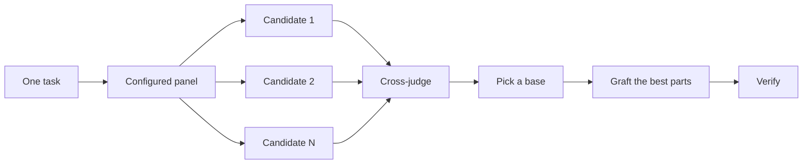

# Design before you write code

One attempt at a hard design locks in the first shape the model thought of. `/architect` settles types and boundaries before implementation. `/arena` runs several attempts at the same brief and merges the best parts. `/interrogate` has other models try to break the result. When the job is coverage rather than design synthesis, `/swarm` fans out slices or races and aggregates their results.


## Settle the shape with `/architect`

```text
/architect design the import pipeline before writing any code. i care most about how callers use it.
```

[`/architect`](../../skills/architect/SKILL.md) grounds itself first, running `/how` over the code the design touches and `/why` when it moves ownership or layers. Then it runs `/arena` to produce competing design sketches, with caller usage first, followed by types, signatures, and a module map.

By default it proceeds from the synthesized design into implementation. Ask for a checkpoint when you want to review the design first:

```text
/architect with checkpoint. stop and show me before implementing.
```

## Fan out attempts with `/arena`

```text
/arena take my prompt to the arena verbatim. i want to compare their proposals with yours.
```

[`/arena`](../../skills/arena/SKILL.md) gives N subagents the same design or code brief, each in an isolated output location. A read-only cross-judge scores candidates against a rubric. The lead reads every candidate, picks a base, grafts the strongest parts from the others, and verifies the synthesized result.



The panel comes from your [`/setup-ystack`](../../skills/setup-ystack/SKILL.md) configuration, and you can adjust it per task.

## Cover slices and races with `/swarm`

```text
/swarm check every package under packages/ against its check.sh. one worker per package. one report.
```

[`/swarm`](../../skills/swarm/SKILL.md) fans workers across independent slices, coverage matrices, gauntlet lanes, exploration partitions, or declared race arms. `/arena` gives every worker the same artifact and synthesizes one winner; `/swarm` covers distinct slices or races independently.

## Break it with `/interrogate`

```text
/interrogate the whole branch, but skeptically. no nitpicks unless it is an actual bug or regression.
```

[`/interrogate`](../../skills/interrogate/SKILL.md) sends the same diff, intent, and rubric to several reviewers. The lead deduplicates findings and sorts them into `Act on`, `Consider`, `Noted`, and `Dismissed`, with reasons.

## How much design work does a task deserve?

- A small finished change you are unsure about may need `/interrogate` alone.
- Boundary-crossing work earns `/architect`, which brings `/arena` with it.
- A standalone artifact with several valid shapes can use `/arena` directly.
- A coverage matrix or parallel race belongs to `/swarm`.
- A contested, expensive-to-reverse design gets `/architect`, then `/interrogate` before shipping.

`/ystack` and `/poteto-mode` apply this ladder automatically.

Next: [Build and clean the change](./05-build-and-clean.md).
