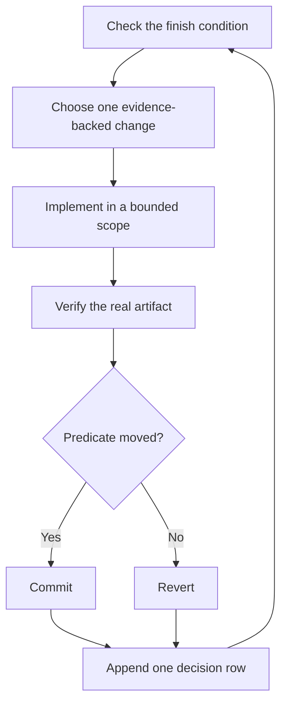

# Run work while you sleep

An agent you can trust to verify its own work is an agent you can leave with a bounded hard task. Safety comes from a checkable finish condition, isolated workspace, explicit permission boundary, and decision trail you can audit afterward.


## The unattended-run contract

```text
/ystack I am going to bed. Migrate every caller to the new parser in a fresh worktree off <base>.
Done means zero old callers, every parser fixture passes, the old API is deleted, and the real command works.
Keep a decision trail. You may commit on the task branch. Do not merge, deploy, or force-push.
Continue until the predicate passes. If a genuine blocker survives the investigation loop, pause safely and document it.
```

Each line serves a purpose:

- “I am going to bed” authorizes autonomous continuation without routine check-ins.
- “Done means…” creates a predicate every iteration can evaluate.
- A fresh worktree isolates the run from unrelated local work.
- Commit permission avoids a predictable reversible-action pause.
- Explicit merge, deploy, and history-rewrite boundaries preserve irreversible checkpoints.
- The escape hatch turns a dead end into a reviewable handoff.

The active coding agent may provide a native long-running mechanism. The [Autonomous run playbook](../../skills/poteto-mode/playbooks/autonomous-run.md) uses it when available. Otherwise ystack keeps the same iteration contract in the current session and relies on [Pause safely](../../skills/poteto-mode/playbooks/pause-safely.md) plus [Session pickup](../../skills/poteto-mode/playbooks/session-pickup.md) across session boundaries.

For broad or unusual unattended work, ystack may route through [`/figure-it-out`](../../skills/figure-it-out/SKILL.md) to design phases, evidence, and the decision trail before implementation.

## What the loop does



One hypothesis, one change, one check, and one decision row per iteration. Changes that do not help are reverted. A plateau triggers a new mechanism or a safe pause; it does not relax the finish condition.

## The morning audit

[`/show-me-your-work`](../../skills/show-me-your-work/SKILL.md) makes the run reviewable. Each TSV row records the time, phase, decision, reason, evidence pointer, and result.

```text
/show-me-your-work catch me up on the unattended run
```

When independent helpers are available, a fresh reviewer looks for weak evidence, wrong-surface verification, scope creep, and risky decisions.

## One task, a queue, or a program

[Autopilot-full](../../skills/poteto-mode/playbooks/autopilot-full.md) handles a queue of independent pull requests. [Autopilot-stack](../../skills/poteto-mode/playbooks/autopilot-stack.md) builds one ordered stack without landing it. [Orchestrate](../../skills/poteto-mode/playbooks/orchestrate.md) coordinates a program that outlives one agent session.

**Pitfall:** duration is not a finish condition. State what must be true, how it will be checked, which actions are allowed, and when to pause safely.

Next: [Steer with principle names](./08-principles.md).
