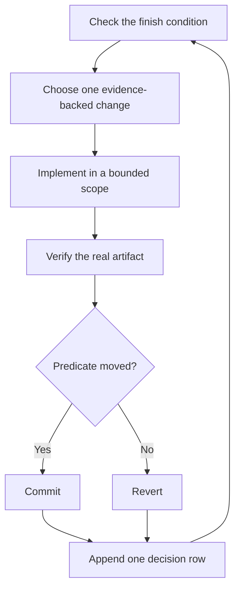

# Run work while you sleep

An agent you can trust to verify its own work is an agent you can leave with a bounded hard task. What makes that safe is not hope. It is a checkable finish condition, an isolated workspace, an explicit permission boundary, and a decision trail you can audit afterward.


## The unattended-run contract

A useful handoff names the goal, finish condition, permissions, and escape hatch:

```text
/poteto-mode I am going to bed. Migrate every caller to the new parser in a fresh worktree off <base>.
Done means zero old callers, every parser fixture passes, the old API is deleted, and the real command works.
Keep a decision trail. You may commit on the task branch. Do not merge, deploy, or force-push.
Continue until the predicate passes. If a genuine blocker survives the investigation loop, pause safely and document it.
```

Each line serves a purpose:

- “I am going to bed” authorizes autonomous continuation without routine check-ins.
- “Done means…” creates a predicate every iteration can evaluate.
- A fresh worktree isolates the run from unrelated local work.
- Commit permission avoids a predictable reversible-action pause.
- Explicit merge, deploy, and history-rewrite boundaries preserve irreversible checkpoints.
- The escape hatch turns a true dead end into a reviewable handoff rather than hours of goal reinterpretation.

The active coding agent may provide a native long-running or loop mechanism. The [Autonomous run playbook](../../skills/poteto-mode/playbooks/autonomous-run.md) uses it when available. When the host does not provide one, pstack keeps the same iteration contract in the current session and relies on [Pause safely](../../skills/poteto-mode/playbooks/pause-safely.md) plus [Session pickup](../../skills/poteto-mode/playbooks/session-pickup.md) across session boundaries.

For broad or unusual unattended work, `/poteto-mode` may route through [`/figure-it-out`](../../skills/figure-it-out/SKILL.md) to design the phases, evidence contract, and decision trail before implementation starts.

## What the loop does



One hypothesis, one change, one check, and one decision row per iteration. Changes that do not help are reverted rather than left to ride. A plateau triggers a new mechanism or a safer pause; it does not relax the finish condition.

## The morning audit

[`/show-me-your-work`](../../skills/show-me-your-work/SKILL.md) makes the run reviewable. Each TSV row records the time, phase, decision, reason, evidence pointer, and result. The log stays local by default and is committed only when the work is large or risky enough that reviewers need it.

When you return, ask for a review-form recap:

```text
/show-me-your-work catch me up on the unattended run
```

The skill checks the log against repository state, verification artifacts, and whatever authorized action or session evidence the host exposes. When independent helpers are available, a fresh reviewer looks for weak evidence, wrong-surface verification, scope creep, and risky decisions. Read the resulting **Attention** section first, then inspect the rows it cites.

## One task, a queue, or a program

The contract above drives one task toward one finish predicate. Larger unattended workloads use different playbooks.

[Autopilot-full](../../skills/poteto-mode/playbooks/autopilot-full.md) handles a queue of independent pull requests. Each pull request has one owner and an independent verification gate. Use it only when the user has explicitly authorized the intended merge behavior:

```text
/poteto-mode full autopilot on this independent queue. Verify every final head. Merge only under the permissions stated here.
```

[Autopilot-stack](../../skills/poteto-mode/playbooks/autopilot-stack.md) builds one ordered stack without landing it. Choose it for coupled changes or when you want to inspect the entire stack before any merge:

```text
/poteto-mode build these five changes as one verified stack. Do not merge. I will review it in the morning.
```

[Orchestrate](../../skills/poteto-mode/playbooks/orchestrate.md) is for a program that outlives one agent session: multiple phases, many pull requests, several owners, and a persistent coordination record. It is deliberately heavier than an overnight task:

```text
/poteto-mode orchestrate the store migration until every package is converted and reviewable. Keep irreversible actions behind my checkpoint.
```

**Pitfall:** duration is not a finish condition. “Work for four hours” gives the agent no objective predicate. State what must be true, how it will be checked, which actions are allowed, and when to pause safely.

Next: [Steer with principle names](./08-principles.md).
